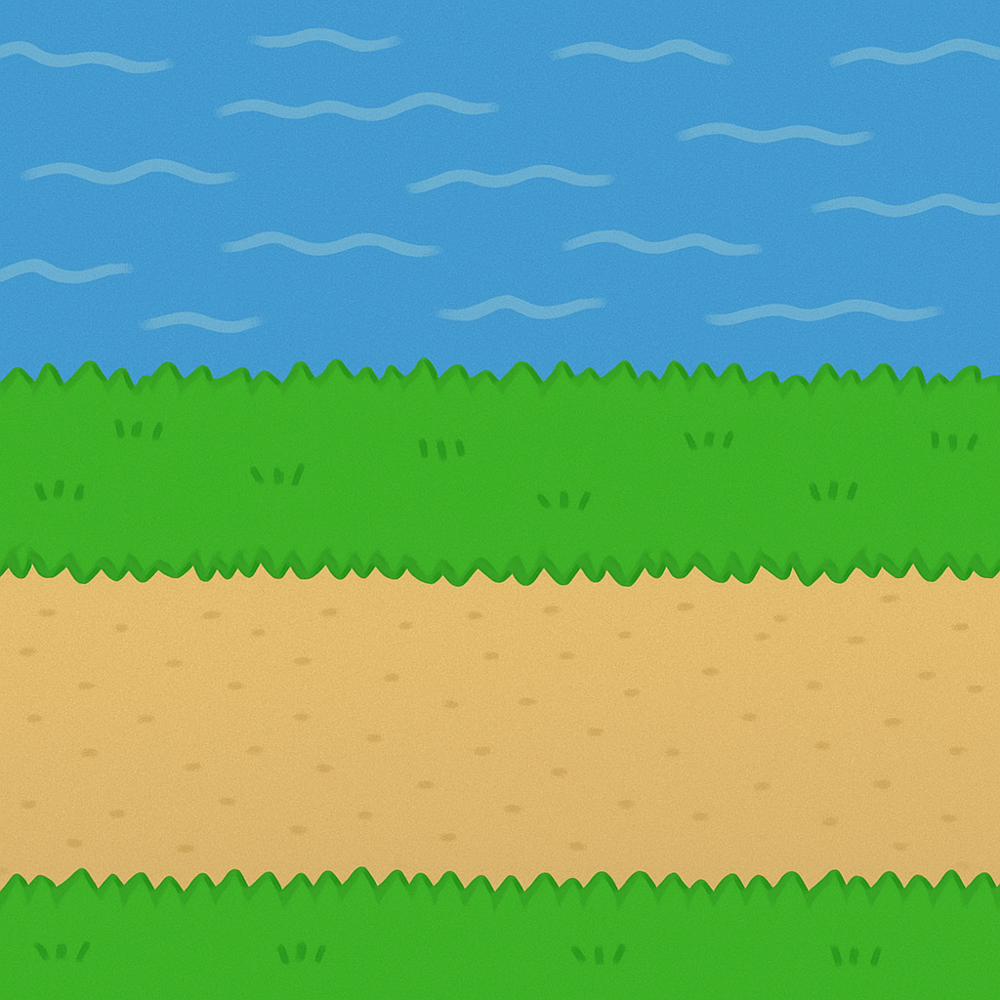
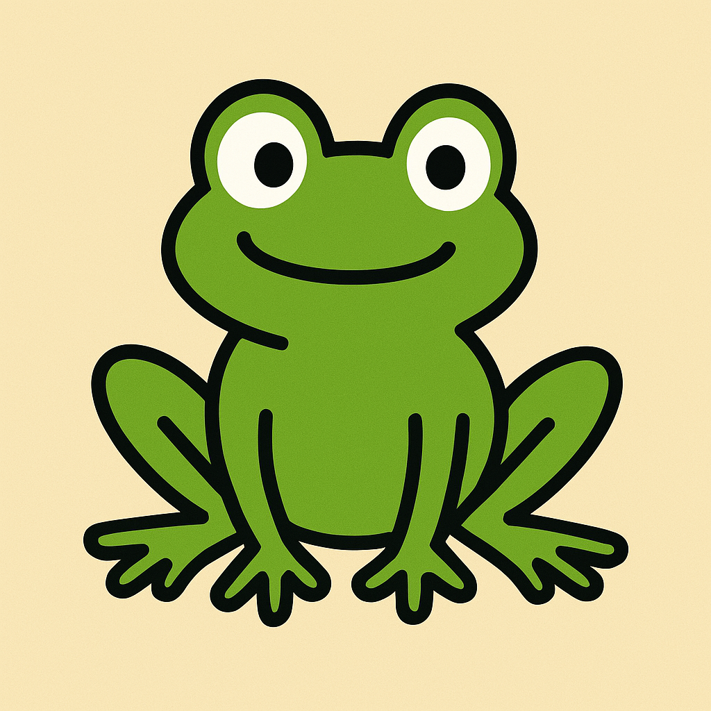

# Guida per creare Frogger con Scratch

Questa guida ti mostrerà come creare la prima versione del classico gioco Frogger utilizzando Scratch. Seguendo questi passaggi, imparerai a disegnare lo stage, creare gli sprite necessari e programmare i movimenti di base.

## Indice
1. [Introduzione al gioco Frogger](#introduzione-al-gioco-frogger)
2. [Disegnare lo stage](#disegnare-lo-stage)
3. [Creare gli sprite](#creare-gli-sprite)
4. [Programmare la rana](#programmare-la-rana)
5. [Programmare gli autoveicoli](#programmare-gli-autoveicoli)
6. [Concetti teorici](#concetti-teorici)

## Introduzione al gioco Frogger

Frogger è un classico gioco arcade dove il giocatore controlla una rana che deve attraversare una strada trafficata e un fiume per raggiungere l'altra sponda. In questa prima versione, ci concentreremo sulla creazione di:
- Uno stage con una strada
- Una rana controllabile dal giocatore
- Tre autoveicoli che si muovono lungo la strada

## Disegnare lo stage

1. **Avvia Scratch** e crea un nuovo progetto
2. **Seleziona lo stage** cliccando sull'icona dello stage nell'angolo in basso a destra
3. **Vai alla scheda "Sfondi"** nella parte superiore dell'editor
4. **Clicca su "Disegna"** per creare un nuovo sfondo
5. **Disegna lo stage** con questi elementi:
   - Una strada nella parte inferiore (colore grigio scuro)
   - Strisce pedonali bianche sulla strada
   - Un'area verde sopra e sotto la strada (rappresenta l'erba)
   - Opzionale: aggiungi un fiume nella parte superiore



## Creare gli sprite

### Creare la rana

1. **Clicca sul pulsante "Scegli uno sprite"** in basso a destra
2. **Seleziona "Disegna"** per creare un nuovo sprite
3. **Disegna la rana** usando forme semplici:
   - Un cerchio verde per il corpo
   - Due cerchi più piccoli per gli occhi
   - Quattro linee per le zampe

Alternativamente, puoi utilizzare l'immagine fornita:



### Creare i tre autoveicoli

1. **Crea il primo autoveicolo**:
   - Clicca su "Scegli uno sprite" e seleziona "Disegna"
   - Disegna un rettangolo colorato (ad esempio rosso) per rappresentare un'auto
   - Aggiungi dettagli come finestrini e ruote

2. **Crea il secondo autoveicolo**:
   - Ripeti il processo per creare un'auto di colore e dimensioni diverse (ad esempio blu)

3. **Crea il terzo autoveicolo**:
   - Crea un terzo veicolo, magari più grande come un camion (ad esempio verde)

## Programmare la rana

Ora programmiamo la rana per farla muovere usando i tasti freccia:

1. **Seleziona lo sprite della rana**
2. **Vai alla scheda "Codice"**
3. **Aggiungi questo codice**:

```
quando si clicca sulla bandiera verde
porta a x: (0) y: (-140)
per sempre
  se <tasto [freccia su v] premuto?> allora
    punta in direzione (0)
    fai (10) passi
  fine
  se <tasto [freccia giù v] premuto?> allora
    punta in direzione (180)
    fai (10) passi
  fine
  se <tasto [freccia destra v] premuto?> allora
    punta in direzione (90)
    fai (10) passi
  fine
  se <tasto [freccia sinistra v] premuto?> allora
    punta in direzione (-90)
    fai (10) passi
  fine
fine
```

Questo codice fa sì che:
- La rana inizi nella parte inferiore dello stage
- Si muova nella direzione corrispondente quando viene premuto un tasto freccia
- Continui a controllare gli input del giocatore per sempre

## Programmare gli autoveicoli

Ora programmiamo i tre autoveicoli per farli muovere lungo la strada:

### Primo autoveicolo (da sinistra a destra)

1. **Seleziona il primo sprite dell'autoveicolo**
2. **Aggiungi questo codice**:

```
quando si clicca sulla bandiera verde
porta a x: (-240) y: (-100)
per sempre
  fai (5) passi
  se <posizione x > (240)> allora
    porta a x: (-240)
  fine
fine
```

### Secondo autoveicolo (da destra a sinistra)

1. **Seleziona il secondo sprite dell'autoveicolo**
2. **Aggiungi questo codice**:

```
quando si clicca sulla bandiera verde
porta a x: (240) y: (-60)
punta in direzione (-90)
per sempre
  fai (7) passi
  se <posizione x < (-240)> allora
    porta a x: (240)
  fine
fine
```

### Terzo autoveicolo (da sinistra a destra, più veloce)

1. **Seleziona il terzo sprite dell'autoveicolo**
2. **Aggiungi questo codice**:

```
quando si clicca sulla bandiera verde
porta a x: (-240) y: (-20)
per sempre
  fai (10) passi
  se <posizione x > (240)> allora
    porta a x: (-240)
  fine
fine
```

## Concetti teorici

In questo progetto abbiamo applicato diversi concetti fondamentali della programmazione:

### 1. Sistema di coordinate in Scratch

In Scratch, lo stage utilizza un sistema di coordinate cartesiane:
- Il centro dello stage ha coordinate (0,0)
- L'asse X va da -240 (sinistra) a 240 (destra)
- L'asse Y va da -180 (basso) a 180 (alto)

Quando programmiamo il movimento degli sprite, utilizziamo queste coordinate per posizionarli e controllare i loro spostamenti.

### 2. Eventi e gestione degli input

Abbiamo utilizzato l'evento "quando si clicca sulla bandiera verde" per avviare il gioco e i blocchi condizionali "se" per rilevare quando il giocatore preme i tasti freccia. Questo è un esempio di programmazione guidata dagli eventi, dove il codice risponde a specifici input dell'utente.

### 3. Cicli e strutture di controllo

Il blocco "per sempre" è un ciclo infinito che continua a eseguire le istruzioni al suo interno finché il programma è in esecuzione. All'interno di questo ciclo, utilizziamo strutture condizionali ("se") per controllare il comportamento degli sprite in base a determinate condizioni.

### 4. Movimento e direzione

Per controllare il movimento degli sprite, abbiamo utilizzato:
- "punta in direzione" per orientare lo sprite
- "fai passi" per spostare lo sprite nella direzione in cui è orientato
- "porta a x: y:" per posizionare gli sprite in punti specifici dello stage

### 5. Rilevamento dei bordi

Per gli autoveicoli, abbiamo implementato un semplice sistema di rilevamento dei bordi: quando un veicolo raggiunge il bordo dello stage, viene riposizionato sul lato opposto, creando l'illusione di un flusso continuo di traffico.

---

Questa è solo la prima versione del gioco Frogger. Puoi espanderlo aggiungendo:
- Rilevamento delle collisioni tra la rana e i veicoli
- Un fiume con tronchi galleggianti
- Un sistema di punteggio
- Livelli di difficoltà crescente

Buon divertimento con la programmazione!